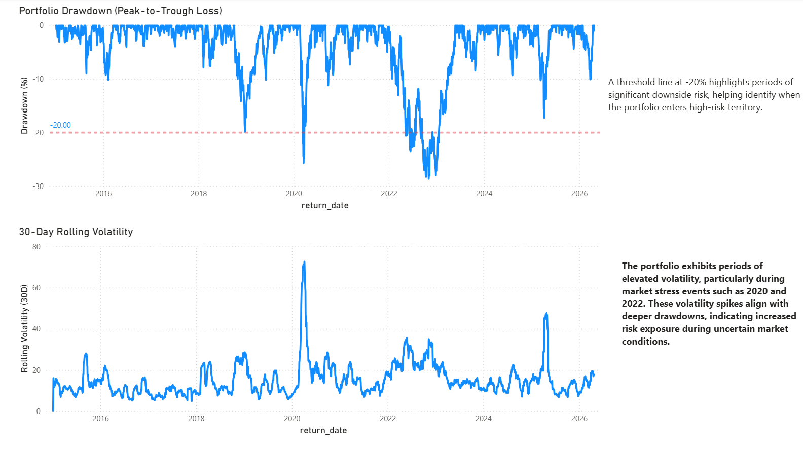
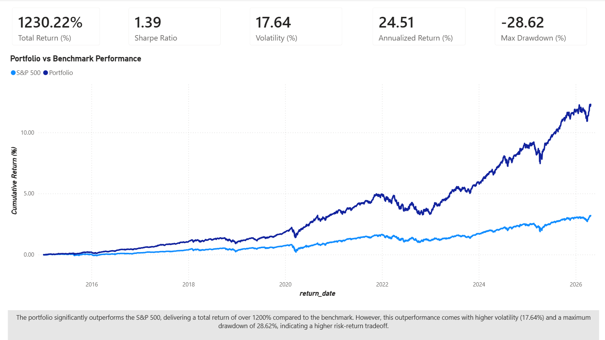

# 📊 Portfolio Analytics: Risk & Performance Dashboard

🚀 End-to-end financial analytics project demonstrating data engineering, SQL analysis, and business intelligence using Python, SQL, and Power BI.

---

## 📌 Overview
This project analyzes the performance and risk of a multi-asset investment portfolio and compares it against the S&P 500 benchmark.

It includes data collection, transformation, financial metric calculation, and interactive dashboarding to evaluate portfolio performance and risk.

---

## ⚙️ Tech Stack
- Python (Pandas, NumPy, yfinance)
- SQL (SQLite, window functions, CTEs)
- Power BI (DAX, data modeling, dashboarding)

---

## 📊 Key Features
- Portfolio vs S&P 500 benchmark comparison
- Performance metrics:
  - Annualized Return: **~24%**
  - Sharpe Ratio: **~1.39**
  - Volatility: **~17.6%**
- Risk analysis:
  - Maximum Drawdown: **-28.6%**
  - Rolling 30-day volatility
- Asset allocation and contribution analysis

---

## 📈 Key Insights
- Portfolio delivered **1200%+ cumulative return**, significantly outperforming the S&P 500
- Higher returns were accompanied by **increased volatility and deeper drawdowns**
- Volatility spikes aligned with major market stress periods (**2020, 2022**)

---

## 🖥️ Dashboard

### Executive Summary

### Risk Analysis

---

## 📂 Project Structure
- `src/` → Data collection and transformation (Python)
- `datasets/` → Processed datasets
- `db/` → SQLite database
- `sql/` → Analytical SQL queries
- `dashboard/` → Power BI dashboard
- `images/` → Dashboard screenshots

---

## 💡 Business Impact
This project demonstrates how financial data can be transformed into actionable insights to evaluate performance, manage risk, and support investment decision-making.

---

## 🔗 How to Run
1. Open the notebook in `src/` to generate datasets
2. Load data into SQLite database
3. Run SQL queries from `sql/analytics_queries.sql`
4. Open `dashboard/portfolio_dashboard.pbix` in Power BI

---

## 📬 Author
Murali Prateek Manthri
